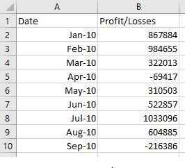

# Py Me Up, Charlie :snake:

## PyBank Challenge

### This challenge creates a Python script for analyzing the financial records of a company using financial data called budget_data.csv. 

### This Python script will analyzes the records to calculate each of the following:

 -The total number of months included in the dataset

 -The net total amount of "Profit/Losses" over the entire period

 -Calculate the changes in "Profit/Losses" over the entire period, then find the average of those changes

 -The greatest increase in profits (date and amount) over the entire period

 -The greatest decrease in losses (date and amount) over the entire period

 -The final script will both print the analysis to the terminal and export a text file with the results

 - An example of what the analysis should will look like is shown below:

# ______________________________________________________________________

## PyPoll Vote Counting Challenge

### This challenge writes a script that helps a small, rural town modernize its vote counting process using a set of poll data called election_data.csv. 

### This Python script will analyze the records to calculate each of the following:

  - The total number of votes cast

  - A complete list of candidates who received votes

  - The percentage of votes each candidate won

  - The total number of votes each candidate won

  - The winner of the election based on popular vote.
 
  - The final script will both print the analysis to the terminal and export a text file with the results

  - An example of what the analysis should will look like is shown below:

